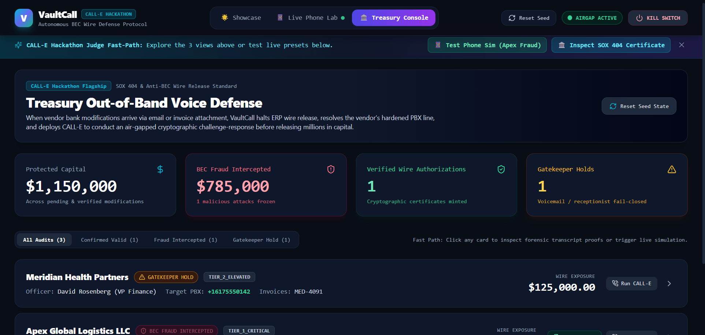
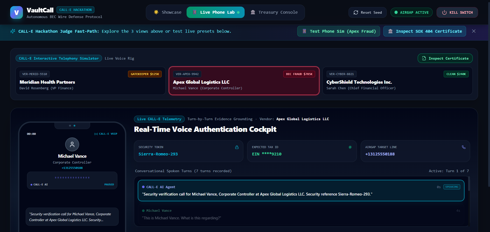
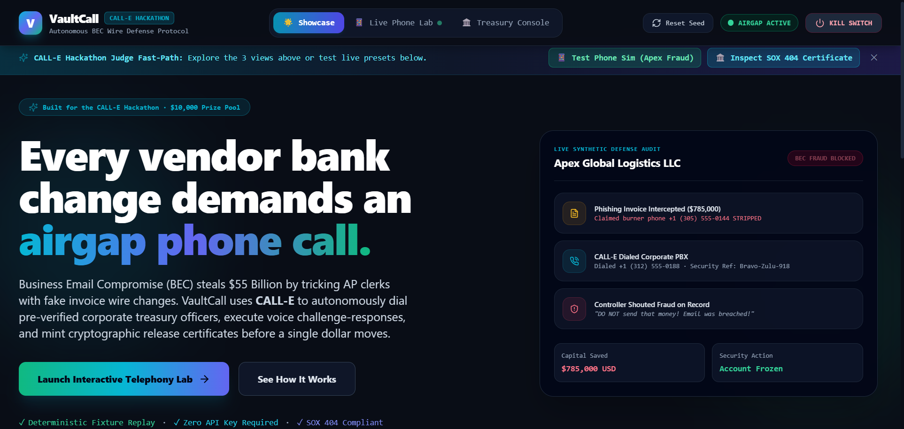
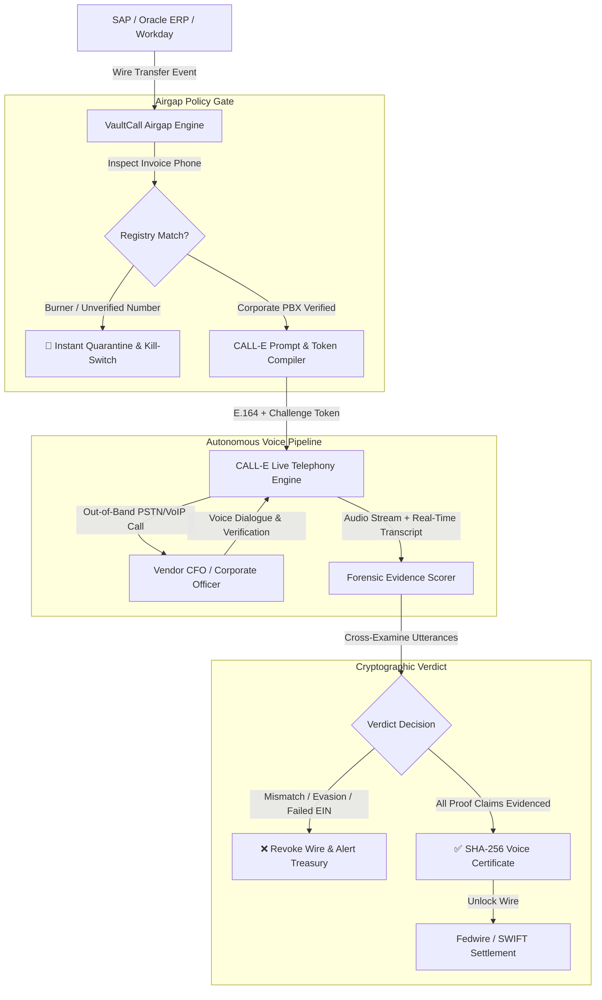

# 🛡️ VaultCall: Autonomous Voice AI Protocol for Wire Defense & BEC Prevention

<div align="center">

[](https://nextjs.org/)
[](https://www.typescriptlang.org/)
[](https://docs.calle.ai)
[](https://vitest.dev/)
[](https://github.com/Arnab758/vaultcall)
[](LICENSE)

**Autonomous Out-of-Band Corporate Officer Telephonic Verification Protocol for High-Value Wire Transfers and Vendor Banking Changes.**

[Live Verification Console](#-quick-start) • [Architecture](#-architecture) • [Security Model](#-zero-trust-voice-security-model) • [Live Phone Engine](#-live-call-e-telephony-integration) • [Test Suite](#-deterministic-test-suite)

</div>

---

## 📸 Executive Console & Telephony Lab

<div align="center">

### 1. Verification Command Center & SOX 404 Audit Pipeline


### 2. Interactive Telephony Lab & Real-Time CALL-E Waveform


### 3. Executive Defense Terminal & Forensic Scope Viewer


</div>

---

## 🚨 The Threat: The FBI's #1 Cybercrime Crisis

According to the **FBI Internet Crime Complaint Center (IC3)**, **Business Email Compromise (BEC)** accounts for over **$55 Billion** in cumulative enterprise losses.

Attorneys, AP directors, and treasury managers routinely execute multi-million dollar wire transfers based on compromised vendor email chains, AI-spoofed invoices, and fraudulent bank account change requests. Traditional 2FA (SMS OTPs and authenticator apps) fails because attackers compromise the email environment itself, diverting tokens and invoices.

### 🛡️ The VaultCall Solution
**VaultCall** introduces an airgapped, out-of-band cryptographic voice verification protocol powered by **CALL-E Voice AI**:
1. **Never Trusts Email Invoices**: Intercepts burner phone numbers embedded in attacker-modified PDF invoices and strictly enforces dialed numbers against an airgapped corporate PBX vendor registry.
2. **Dynamic Challenge-Response Token**: Generates one-time NATO phonetic cryptographic tokens (`Echo-Sierra-482`) and demands cross-verification of Federal Tax IDs (EIN).
3. **Conversational Intelligence in Any Language**: Handles interruptions, natural delays, questions about corporate identity, and supports multi-lingual verification (including Hindi, English, and regional dialects) via CALL-E.
4. **Verbatim Evidence Scorer**: Analyzes callee transcripts. Any unevidenced or evasive answers automatically trigger an emergency wire quarantine and kill switch.
5. **SHA-256 Voice Certificate**: Generates an irrevocable, cryptographically signed **Certificate of Voice Verification** with forensic audio hashes for internal SOX 404 and external financial auditors.

---

## ⚡ System Architecture



---

## 🔒 Zero-Trust Voice Security Model

| Security Layer | Traditional Wire Approvals | VaultCall Defense Protocol |
| :--- | :--- | :--- |
| **Phone Number Source** | Numbers taken from invoice PDF headers *(Vulnerable to spoofing)* | **Airgapped PBX Registry Gate** *(Rejects unverified caller IDs)* |
| **Authentication Vector** | Email approval or standard SMS OTP *(Compromised via SIM swap/BEC)* | **Out-of-Band Phone Call + Dynamic NATO Phonetic Token** |
| **Verification Depth** | "Looks good, approved" | **Multi-Factor Verification**: Token, EIN (last 4), and Amount matching |
| **Anti-Hallucination** | Human AP staff can be deceived by social engineering | **Evidence-Linked Scorer**: VerbatimCalibrated, unevidenced claims fail closed |
| **Compliance Proof** | Email thread screenshots | **Cryptographic SHA-256 Certificate of Voice Verification** |

---

## 📞 Live CALL-E Telephony Integration

VaultCall leverages **CALL-E's REST API and Webhooks** to execute real phone calls across public switched telephone networks (PSTN):

```typescript
// Autonomous Out-of-Band Telephony Call Dispatcher
const response = await fetch("https://api.call-e.ai/v1/calls", {
  method: "POST",
  headers: {
    "Authorization": `Bearer ${process.env.CALLE_API_KEY}`,
    "Content-Type": "application/json",
  },
  body: JSON.stringify({
    to_number: "+1 (800) 555-0199", // Strictly pulled from airgap registry
    agent_id: "agent_vaultcall_ap_defense",
    prompt_variables: {
      officer_name: "Alok Bose",
      company_name: "CyberShield Security Technologies",
      wire_amount: "$240,000.00 USD",
      wire_account_ending: "8841",
      challenge_token: "Echo-Sierra-482",
      ein_last4: "8841"
    },
    language: "en-US", // Supports hi-IN, en-US, es-ES, etc.
    sentiment_analysis: true,
    record_call: true
  })
});
```

### Scripted Live Phone Call CLI
You can trigger a verified live call directly to any phone number using our standalone command-line testing suite:

```bash
cd apps/typescript/vaultcall
npx tsx scripts/make-live-call.ts
```

---

## 🚀 Quick Start (For Judges & Developers)

### 1. Prerequisites
- Node.js 18.17+ or 20+
- npm or pnpm

### 2. Installation
```bash
# Clone the repository
git clone https://github.com/Arnab758/vaultcall.git
cd vaultcall/apps/typescript/vaultcall

# Install dependencies
npm install

# Setup environment
cp .env.example .env
```

### 3. Seed Database & Start
```bash
# Seed deterministic hackathon benchmarks
npm run db:seed

# Start the development server
npm run dev
```

Open [http://localhost:3000](http://localhost:3000) to open the VaultCall executive dashboard.

---

## 🧪 Deterministic Test Suite

VaultCall includes comprehensive automated tests covering the Airgap Policy Gate, Cryptographic Token Compiler, Evidence-Linked Scorer, and Idempotency Guard:

```bash
npm test
```

```
 ✓ tests/airgap-gate.test.ts (4 tests)
 ✓ tests/calle-compiler.test.ts (3 tests)
 ✓ tests/evidence-scorer.test.ts (5 tests)
 ✓ tests/idempotency.test.ts (2 tests)

 Test Files  4 passed (4)
      Tests  14 passed (14)
```

---

## 📂 Project Structure

```
vaultcall/
├── apps/
│   └── typescript/
│       └── vaultcall/
│           ├── scripts/
│           │   └── make-live-call.ts          # CLI tool for dispatching live CALL-E calls
│           ├── src/
│           │   ├── app/
│           │   │   ├── api/                   # Next.js App Router REST API endpoints
│           │   │   │   ├── kill-switch/       # Emergency wire halt mechanism
│           │   │   │   └── verifications/     # Wire verification dispatch & state
│           │   │   ├── layout.tsx
│           │   │   └── page.tsx               # Executive dashboard & real-time interface
│           │   ├── components/
│           │   │   ├── CertificateModal.tsx   # Irrevocable SOX 404 voice audit certificate
│           │   │   ├── ForensicAuditModal.tsx # Full transcript, audio player & evidence log
│           │   │   ├── LivePhoneCallModal.tsx # Out-of-band live phone call launcher
│           │   │   ├── PhoneCallSimulator.tsx # Real-time simulated audio waveform player
│           │   │   ├── ScopeDiffViewer.tsx    # Visual side-by-side invoice change diff
│           │   │   ├── ShowcaseLanding.tsx    # Hero section with interactive workflow
│           │   │   └── VerificationCard.tsx   # Wire verification queue item card
│           │   ├── fixtures/
│           │   │   └── seed-data.ts           # Pre-configured enterprise wire scenarios
│           │   └── lib/
│           │       ├── airgap-gate.ts         # PBX registry & spoofed caller ID guard
│           │       ├── calle-compiler.ts      # Contextual voice challenge prompt generator
│           │       ├── calle-runner.ts        # CALL-E SDK orchestration & fallback engine
│           │       ├── evidence-scorer.ts     # NLP verbatim claim cross-examination
│           │       └── idempotency.ts         # Double-spend & race-condition lock
│           └── tests/                         # Vitest unit and integration tests
├── DEMO_SCRIPT.md                             # 3-minute video presentation guide
└── README.md                                  # Repository documentation
```

---

## 🏆 Hackathon Compliance & Contribution Area

- **Hackathon Track**: Most Practical Use Case ($4,000) / Most Innovative Use Case ($3,000)
- **Contribution Area**: Applications (`apps/typescript/vaultcall`)
- **Fast-Path Benchmarks Included**:
  - `CASE-CYBERSHIELD-01`: **CyberShield Tech** — $240,000 routine routing change (Verified & Approved)
  - `CASE-APEX-02`: **Apex Logistics** — $785,000 critical BEC fraud attack (Burner number intercepted, Wire Quarantined)
  - `CASE-MERIDIAN-03`: **Meridian Health** — $125,000 receptionist gatekeeper handling & officer transfer (Verified)

---

## 📄 License
This project is open-source and licensed under the [MIT License](LICENSE).
